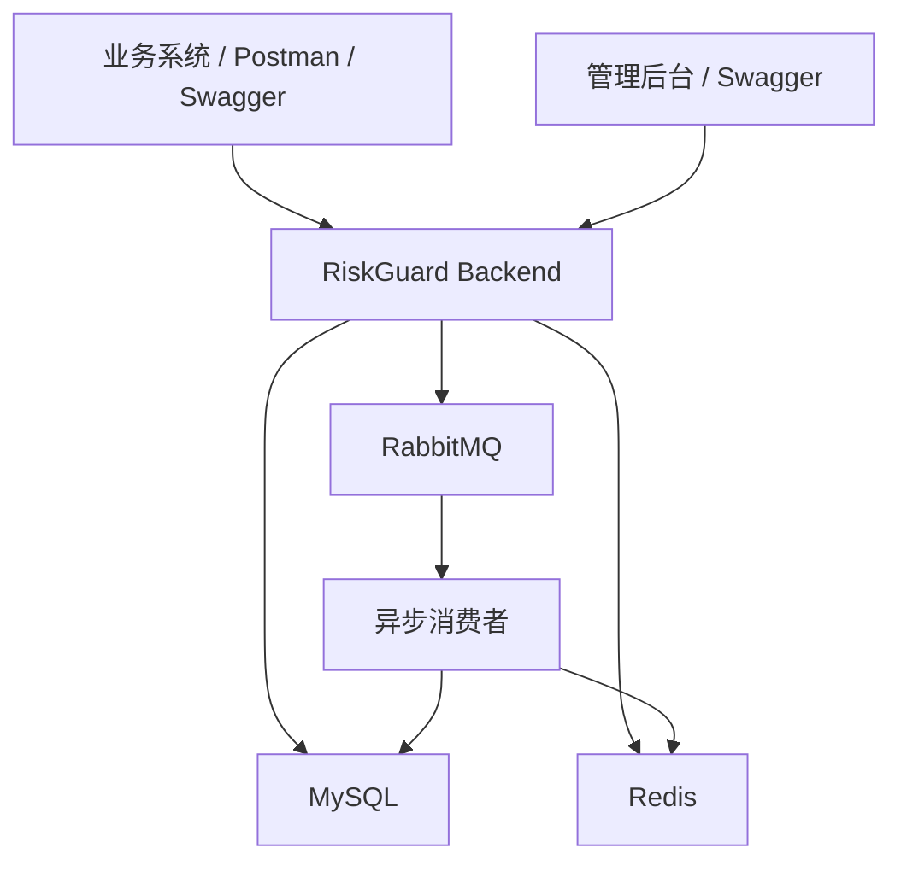
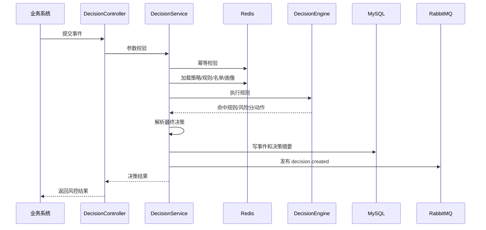

# RiskGuard MVP 开发冻结版设计

版本：v0.1  
日期：2026-05-01  
定位：用于冻结 RiskGuard 第一阶段开发范围、技术选型、数据模型、接口边界和实现顺序。

## 1. MVP 目标

RiskGuard MVP 的目标不是做完整金融级反欺诈系统，而是实现一个可运行、可演示、可扩展的实时风控决策平台闭环。

第一阶段必须完成：

- 业务系统可以提交登录、支付风控事件。
- 系统可以根据已发布策略加载规则并执行表达式。
- 系统可以计算风险分，返回 `PASS`、`VERIFY`、`REVIEW`、`REJECT`。
- 系统可以记录风控事件、决策日志和命中规则。
- 系统可以维护规则、策略、黑白名单。
- 高风险事件可以自动生成审核案件。
- 审核员可以处理案件。
- 系统可以提供基础看板统计接口。

第一阶段不做：

- 不做真实机器学习训练平台。
- 不做 Flink 实时计算。
- 不做复杂设备指纹 SDK。
- 不做风控关系图谱。
- 不做多租户。
- 不做复杂 RBAC 权限模型。
- 不让 AI 参与最终放行或拒绝决策。
- 不在实时决策主链路中调用大模型。

## 2. 技术选型冻结

### 2.1 后端

| 技术 | 选择 | 说明 |
| --- | --- | --- |
| JDK | Java 17 | Spring Boot 3 推荐基线 |
| 框架 | Spring Boot 3.x | 主应用框架 |
| Web | Spring MVC | REST API |
| ORM | MyBatis-Plus | 快速完成 CRUD 与分页 |
| 权限 | Spring Security + JWT | MVP 简化登录鉴权 |
| 数据库 | MySQL 8 | 核心业务数据 |
| 缓存 | Redis | 策略、规则、名单、画像、幂等 |
| MQ | RabbitMQ | 异步日志、画像更新、案件后处理 |
| 规则表达式 | AviatorScript | Java 生态成熟，适合轻量规则表达式 |
| API 文档 | Knife4j / OpenAPI | 接口调试和文档 |
| 日志 | Logback + TraceId | 请求追踪 |
| 构建 | Maven | Java 项目主流选择 |

### 2.2 前端

MVP 先以后端 API + Swagger/Knife4j 验证为主。后台前端作为第二阶段。

第二阶段前端技术栈：

- Vue 3
- TypeScript
- Element Plus
- ECharts

### 2.3 部署

MVP 使用 Docker Compose 编排：

- riskguard-backend
- mysql
- redis
- rabbitmq

Elasticsearch 和 AI 模块放到二期接入。

## 3. 架构冻结

MVP 采用模块化单体架构，包边界按未来可拆服务设计。



核心原则：

- 实时决策链路优先保证低延迟。
- 策略、规则、名单从 Redis 优先读取，缓存未命中时读 MySQL。
- 决策摘要同步落库，非关键后处理通过 RabbitMQ 异步处理。
- AI 能力不进入 MVP 主链路，只预留扩展口。

## 4. 后端包结构冻结

```text
com.riskguard
├── RiskGuardApplication
├── common
│   ├── api
│   ├── config
│   ├── constant
│   ├── exception
│   ├── security
│   ├── trace
│   └── utils
├── auth
│   ├── controller
│   ├── dto
│   ├── entity
│   ├── mapper
│   └── service
├── decision
│   ├── controller
│   ├── dto
│   ├── entity
│   ├── mapper
│   └── service
├── engine
│   ├── context
│   ├── evaluator
│   ├── model
│   ├── resolver
│   └── scorer
├── rule
├── strategy
├── risklist
├── profile
├── riskcase
├── dashboard
├── audit
└── mq
```

核心类职责：

| 类 | 职责 |
| --- | --- |
| `RiskDecisionController` | 接收实时决策请求 |
| `RiskDecisionService` | 编排完整决策流程 |
| `RiskContextBuilder` | 构建规则执行上下文 |
| `StrategyLoader` | 加载当前生效策略 |
| `RuleEvaluator` | 执行表达式 |
| `DecisionEngine` | 执行策略规则，输出引擎结果 |
| `RiskScorer` | 汇总分数 |
| `DecisionResolver` | 生成最终决策 |
| `DecisionLogService` | 写事件、决策日志、命中规则 |
| `RiskCaseService` | 生成和处理人工审核案件 |
| `RiskListService` | 黑白名单维护与命中判断 |
| `DashboardService` | 看板统计 |

## 5. 决策链路冻结

实时决策接口路径：

```text
POST /api/v1/risk/decisions
```

同步链路：



异步链路：

- 写入命中规则明细。
- 根据 `REVIEW` 结果生成案件。
- 更新用户、设备、IP 画像统计。
- 统计看板指标预聚合。

MVP 可以先同步写命中规则和同步生成案件，RabbitMQ 在后续迭代中接入。代码结构要为异步保留事件发布接口。

## 6. 决策规则冻结

### 6.1 风险分区间

| 分数 | 风险等级 | 默认决策 |
| --- | --- | --- |
| 0-30 | `LOW` | `PASS` |
| 31-60 | `MEDIUM` | `VERIFY` |
| 61-80 | `HIGH` | `REVIEW` |
| 81-100 | `CRITICAL` | `REJECT` |

### 6.2 规则动作优先级

```text
REJECT > REVIEW > VERIFY > SCORE
```

最终决策逻辑：

1. 命中 `REJECT` 规则，直接 `REJECT`。
2. 未命中 `REJECT`，但命中 `REVIEW` 规则，返回 `REVIEW`。
3. 未命中强动作规则，根据风险分区间返回默认决策。

### 6.3 表达式上下文

```json
{
  "event": {
    "eventType": "PAYMENT",
    "amount": 1299.00,
    "scene": "APP"
  },
  "user": {
    "registerDays": 3,
    "realNameVerified": false,
    "payCount24h": 4,
    "failedLoginCount10m": 0
  },
  "device": {
    "accountCount24h": 6,
    "paymentCount24h": 3
  },
  "ip": {
    "failedLoginCount10m": 2,
    "accountCount24h": 8
  },
  "list": {
    "userBlacklistHit": false,
    "ipBlacklistHit": false,
    "deviceBlacklistHit": false,
    "userWhitelistHit": false
  }
}
```

### 6.4 MVP 内置规则

| 规则编码 | 场景 | 表达式 | 动作 | 分值 |
| --- | --- | --- | --- | --- |
| `IP_BLACKLIST_HIT` | 登录/支付 | `list.ipBlacklistHit == true` | `REJECT` | 100 |
| `USER_BLACKLIST_HIT` | 登录/支付 | `list.userBlacklistHit == true` | `REJECT` | 100 |
| `LOGIN_FAIL_5_TIMES` | 登录 | `user.failedLoginCount10m >= 5` | `SCORE` | 25 |
| `IP_MULTI_ACCOUNT_LOGIN` | 登录 | `ip.accountCount24h >= 10` | `SCORE` | 30 |
| `NEW_USER_HIGH_AMOUNT` | 支付 | `user.registerDays <= 7 && event.amount >= 1000` | `SCORE` | 30 |
| `DEVICE_MULTI_ACCOUNT` | 支付 | `device.accountCount24h >= 5` | `SCORE` | 40 |
| `UNVERIFIED_HIGH_AMOUNT` | 支付 | `user.realNameVerified == false && event.amount >= 500` | `SCORE` | 35 |
| `PAYMENT_FREQUENCY_HIGH` | 支付 | `user.payCount24h >= 10` | `SCORE` | 25 |

## 7. 数据库表冻结

### 7.1 表清单

MVP 必建表：

- `sys_user`
- `risk_rule`
- `risk_rule_version`
- `risk_strategy`
- `risk_strategy_rule`
- `risk_strategy_version`
- `risk_list`
- `risk_event`
- `risk_decision_log`
- `risk_decision_hit_rule`
- `risk_case`
- `risk_case_operation_log`
- `risk_user_profile`
- `risk_device_profile`
- `risk_ip_profile`

### 7.2 建表 SQL

```sql
CREATE TABLE sys_user (
    id BIGINT PRIMARY KEY AUTO_INCREMENT,
    username VARCHAR(64) NOT NULL UNIQUE,
    password_hash VARCHAR(255) NOT NULL,
    real_name VARCHAR(64),
    role_code VARCHAR(32) NOT NULL,
    status VARCHAR(32) NOT NULL DEFAULT 'ENABLED',
    created_at DATETIME NOT NULL DEFAULT CURRENT_TIMESTAMP,
    updated_at DATETIME NOT NULL DEFAULT CURRENT_TIMESTAMP ON UPDATE CURRENT_TIMESTAMP
);

CREATE TABLE risk_rule (
    id BIGINT PRIMARY KEY AUTO_INCREMENT,
    rule_code VARCHAR(64) NOT NULL UNIQUE,
    rule_name VARCHAR(128) NOT NULL,
    event_type VARCHAR(32) NOT NULL,
    expression_text TEXT NOT NULL,
    score INT NOT NULL DEFAULT 0,
    action VARCHAR(32) NOT NULL,
    priority INT NOT NULL DEFAULT 100,
    status VARCHAR(32) NOT NULL DEFAULT 'DRAFT',
    version INT NOT NULL DEFAULT 0,
    description VARCHAR(512),
    created_by BIGINT,
    updated_by BIGINT,
    created_at DATETIME NOT NULL DEFAULT CURRENT_TIMESTAMP,
    updated_at DATETIME NOT NULL DEFAULT CURRENT_TIMESTAMP ON UPDATE CURRENT_TIMESTAMP,
    INDEX idx_rule_event_status (event_type, status),
    INDEX idx_rule_code (rule_code)
);

CREATE TABLE risk_rule_version (
    id BIGINT PRIMARY KEY AUTO_INCREMENT,
    rule_id BIGINT NOT NULL,
    version INT NOT NULL,
    expression_text TEXT NOT NULL,
    score INT NOT NULL DEFAULT 0,
    action VARCHAR(32) NOT NULL,
    priority INT NOT NULL DEFAULT 100,
    status VARCHAR(32) NOT NULL,
    publish_note VARCHAR(512),
    created_by BIGINT,
    created_at DATETIME NOT NULL DEFAULT CURRENT_TIMESTAMP,
    UNIQUE KEY uk_rule_version (rule_id, version),
    INDEX idx_rule_version_rule (rule_id)
);

CREATE TABLE risk_strategy (
    id BIGINT PRIMARY KEY AUTO_INCREMENT,
    strategy_code VARCHAR(64) NOT NULL UNIQUE,
    strategy_name VARCHAR(128) NOT NULL,
    event_type VARCHAR(32) NOT NULL,
    status VARCHAR(32) NOT NULL DEFAULT 'DRAFT',
    version INT NOT NULL DEFAULT 0,
    gray_ratio INT NOT NULL DEFAULT 100,
    description VARCHAR(512),
    created_by BIGINT,
    updated_by BIGINT,
    created_at DATETIME NOT NULL DEFAULT CURRENT_TIMESTAMP,
    updated_at DATETIME NOT NULL DEFAULT CURRENT_TIMESTAMP ON UPDATE CURRENT_TIMESTAMP,
    INDEX idx_strategy_event_status (event_type, status),
    INDEX idx_strategy_code (strategy_code)
);

CREATE TABLE risk_strategy_rule (
    id BIGINT PRIMARY KEY AUTO_INCREMENT,
    strategy_id BIGINT NOT NULL,
    rule_id BIGINT NOT NULL,
    rule_version INT NOT NULL,
    execute_order INT NOT NULL DEFAULT 100,
    enabled TINYINT NOT NULL DEFAULT 1,
    created_at DATETIME NOT NULL DEFAULT CURRENT_TIMESTAMP,
    UNIQUE KEY uk_strategy_rule (strategy_id, rule_id),
    INDEX idx_strategy_rule_strategy (strategy_id)
);

CREATE TABLE risk_strategy_version (
    id BIGINT PRIMARY KEY AUTO_INCREMENT,
    strategy_id BIGINT NOT NULL,
    version INT NOT NULL,
    rule_snapshot JSON NOT NULL,
    gray_ratio INT NOT NULL DEFAULT 100,
    status VARCHAR(32) NOT NULL,
    publish_note VARCHAR(512),
    created_by BIGINT,
    created_at DATETIME NOT NULL DEFAULT CURRENT_TIMESTAMP,
    UNIQUE KEY uk_strategy_version (strategy_id, version),
    INDEX idx_strategy_version_strategy (strategy_id)
);

CREATE TABLE risk_list (
    id BIGINT PRIMARY KEY AUTO_INCREMENT,
    list_type VARCHAR(32) NOT NULL,
    object_type VARCHAR(32) NOT NULL,
    object_value VARCHAR(128) NOT NULL,
    risk_level VARCHAR(32),
    effect_type VARCHAR(32) NOT NULL,
    score_delta INT NOT NULL DEFAULT 0,
    reason VARCHAR(512),
    start_time DATETIME,
    end_time DATETIME,
    status VARCHAR(32) NOT NULL DEFAULT 'ENABLED',
    created_by BIGINT,
    created_at DATETIME NOT NULL DEFAULT CURRENT_TIMESTAMP,
    updated_at DATETIME NOT NULL DEFAULT CURRENT_TIMESTAMP ON UPDATE CURRENT_TIMESTAMP,
    UNIQUE KEY uk_list_object (list_type, object_type, object_value),
    INDEX idx_list_lookup (object_type, object_value, status)
);

CREATE TABLE risk_event (
    id BIGINT PRIMARY KEY AUTO_INCREMENT,
    event_no VARCHAR(64) NOT NULL UNIQUE,
    request_no VARCHAR(64) NOT NULL,
    event_type VARCHAR(32) NOT NULL,
    user_id VARCHAR(64),
    device_id VARCHAR(128),
    ip VARCHAR(64),
    amount DECIMAL(18, 2),
    biz_id VARCHAR(128),
    scene VARCHAR(32),
    event_time DATETIME NOT NULL,
    raw_payload JSON,
    created_at DATETIME NOT NULL DEFAULT CURRENT_TIMESTAMP,
    UNIQUE KEY uk_event_request (request_no),
    INDEX idx_event_user_time (user_id, event_time),
    INDEX idx_event_device_time (device_id, event_time),
    INDEX idx_event_type_time (event_type, event_time)
);

CREATE TABLE risk_decision_log (
    id BIGINT PRIMARY KEY AUTO_INCREMENT,
    decision_no VARCHAR(64) NOT NULL UNIQUE,
    event_no VARCHAR(64) NOT NULL,
    request_no VARCHAR(64) NOT NULL,
    event_type VARCHAR(32) NOT NULL,
    user_id VARCHAR(64),
    strategy_id BIGINT,
    strategy_version INT,
    risk_score INT NOT NULL,
    risk_level VARCHAR(32) NOT NULL,
    decision VARCHAR(32) NOT NULL,
    reason TEXT,
    cost_ms INT NOT NULL DEFAULT 0,
    trace_id VARCHAR(64),
    created_at DATETIME NOT NULL DEFAULT CURRENT_TIMESTAMP,
    INDEX idx_decision_event (event_no),
    INDEX idx_decision_user_time (user_id, created_at),
    INDEX idx_decision_result_time (decision, created_at),
    INDEX idx_decision_request (request_no)
);

CREATE TABLE risk_decision_hit_rule (
    id BIGINT PRIMARY KEY AUTO_INCREMENT,
    decision_no VARCHAR(64) NOT NULL,
    rule_id BIGINT NOT NULL,
    rule_code VARCHAR(64) NOT NULL,
    rule_name VARCHAR(128) NOT NULL,
    rule_version INT NOT NULL,
    score_delta INT NOT NULL DEFAULT 0,
    action VARCHAR(32) NOT NULL,
    hit_detail TEXT,
    created_at DATETIME NOT NULL DEFAULT CURRENT_TIMESTAMP,
    INDEX idx_hit_decision (decision_no),
    INDEX idx_hit_rule_time (rule_code, created_at)
);

CREATE TABLE risk_case (
    id BIGINT PRIMARY KEY AUTO_INCREMENT,
    case_no VARCHAR(64) NOT NULL UNIQUE,
    decision_no VARCHAR(64) NOT NULL,
    event_no VARCHAR(64) NOT NULL,
    user_id VARCHAR(64),
    risk_score INT NOT NULL,
    risk_level VARCHAR(32) NOT NULL,
    status VARCHAR(32) NOT NULL DEFAULT 'PENDING',
    assignee_id BIGINT,
    ai_summary TEXT,
    audit_result VARCHAR(32),
    audit_opinion TEXT,
    created_at DATETIME NOT NULL DEFAULT CURRENT_TIMESTAMP,
    updated_at DATETIME NOT NULL DEFAULT CURRENT_TIMESTAMP ON UPDATE CURRENT_TIMESTAMP,
    INDEX idx_case_status_time (status, created_at),
    INDEX idx_case_user_time (user_id, created_at),
    INDEX idx_case_decision (decision_no)
);

CREATE TABLE risk_case_operation_log (
    id BIGINT PRIMARY KEY AUTO_INCREMENT,
    case_no VARCHAR(64) NOT NULL,
    operator_id BIGINT,
    operation VARCHAR(64) NOT NULL,
    before_status VARCHAR(32),
    after_status VARCHAR(32),
    remark TEXT,
    created_at DATETIME NOT NULL DEFAULT CURRENT_TIMESTAMP,
    INDEX idx_case_operation (case_no, created_at)
);

CREATE TABLE risk_user_profile (
    id BIGINT PRIMARY KEY AUTO_INCREMENT,
    user_id VARCHAR(64) NOT NULL UNIQUE,
    register_time DATETIME,
    account_level VARCHAR(32),
    real_name_verified TINYINT NOT NULL DEFAULT 0,
    total_pay_amount DECIMAL(18, 2) NOT NULL DEFAULT 0,
    pay_count_24h INT NOT NULL DEFAULT 0,
    failed_login_count_10m INT NOT NULL DEFAULT 0,
    last_login_ip VARCHAR(64),
    last_login_time DATETIME,
    updated_at DATETIME NOT NULL DEFAULT CURRENT_TIMESTAMP ON UPDATE CURRENT_TIMESTAMP,
    INDEX idx_user_profile_updated (updated_at)
);

CREATE TABLE risk_device_profile (
    id BIGINT PRIMARY KEY AUTO_INCREMENT,
    device_id VARCHAR(128) NOT NULL UNIQUE,
    account_count_24h INT NOT NULL DEFAULT 0,
    account_count_total INT NOT NULL DEFAULT 0,
    payment_count_24h INT NOT NULL DEFAULT 0,
    first_seen_time DATETIME,
    last_seen_time DATETIME,
    updated_at DATETIME NOT NULL DEFAULT CURRENT_TIMESTAMP ON UPDATE CURRENT_TIMESTAMP,
    INDEX idx_device_profile_updated (updated_at)
);

CREATE TABLE risk_ip_profile (
    id BIGINT PRIMARY KEY AUTO_INCREMENT,
    ip VARCHAR(64) NOT NULL UNIQUE,
    login_count_10m INT NOT NULL DEFAULT 0,
    failed_login_count_10m INT NOT NULL DEFAULT 0,
    account_count_24h INT NOT NULL DEFAULT 0,
    payment_count_24h INT NOT NULL DEFAULT 0,
    location VARCHAR(128),
    updated_at DATETIME NOT NULL DEFAULT CURRENT_TIMESTAMP ON UPDATE CURRENT_TIMESTAMP,
    INDEX idx_ip_profile_updated (updated_at)
);
```

## 8. 接口冻结

统一响应：

```json
{
  "code": 0,
  "message": "success",
  "data": {},
  "traceId": "RG-TRACE-001"
}
```

### 8.1 认证接口

| 方法 | 路径 | 说明 |
| --- | --- | --- |
| `POST` | `/api/v1/auth/login` | 管理后台登录 |
| `GET` | `/api/v1/auth/me` | 当前用户信息 |

### 8.2 实时决策接口

| 方法 | 路径 | 说明 |
| --- | --- | --- |
| `POST` | `/api/v1/risk/decisions` | 实时风控决策 |
| `GET` | `/api/v1/risk/decisions/{decisionNo}` | 决策详情 |
| `GET` | `/api/v1/risk/decisions` | 决策日志分页 |
| `POST` | `/api/v1/risk/decisions/simulate` | 策略模拟 |

实时决策请求：

```json
{
  "requestNo": "REQ202605010001",
  "eventType": "PAYMENT",
  "userId": "U10001",
  "deviceId": "D90001",
  "ip": "192.168.1.10",
  "amount": 1299.00,
  "bizId": "ORDER202605010001",
  "scene": "APP",
  "eventTime": "2026-05-01 10:30:00",
  "extra": {
    "payMethod": "BANK_CARD",
    "merchantId": "M10001"
  }
}
```

实时决策响应：

```json
{
  "decisionNo": "D202605010001",
  "decision": "REVIEW",
  "riskScore": 75,
  "riskLevel": "HIGH",
  "hitRules": [
    {
      "ruleCode": "NEW_USER_HIGH_AMOUNT",
      "ruleName": "新用户大额支付",
      "scoreDelta": 30,
      "action": "SCORE"
    }
  ],
  "reason": "命中新用户大额支付、设备多账号规则，建议人工审核",
  "costMs": 38
}
```

### 8.3 规则接口

| 方法 | 路径 | 说明 |
| --- | --- | --- |
| `POST` | `/api/v1/rules` | 新建规则 |
| `PUT` | `/api/v1/rules/{id}` | 编辑规则 |
| `GET` | `/api/v1/rules` | 分页查询 |
| `GET` | `/api/v1/rules/{id}` | 详情 |
| `POST` | `/api/v1/rules/{id}/publish` | 发布版本 |
| `POST` | `/api/v1/rules/{id}/enable` | 启用 |
| `POST` | `/api/v1/rules/{id}/disable` | 停用 |
| `GET` | `/api/v1/rules/{id}/versions` | 版本列表 |
| `POST` | `/api/v1/rules/validate-expression` | 校验表达式 |

### 8.4 策略接口

| 方法 | 路径 | 说明 |
| --- | --- | --- |
| `POST` | `/api/v1/strategies` | 新建策略 |
| `PUT` | `/api/v1/strategies/{id}` | 编辑策略 |
| `GET` | `/api/v1/strategies` | 分页查询 |
| `GET` | `/api/v1/strategies/{id}` | 详情 |
| `POST` | `/api/v1/strategies/{id}/rules` | 绑定规则 |
| `DELETE` | `/api/v1/strategies/{id}/rules/{ruleId}` | 移除规则 |
| `PUT` | `/api/v1/strategies/{id}/rules/order` | 调整顺序 |
| `POST` | `/api/v1/strategies/{id}/publish` | 发布策略 |
| `POST` | `/api/v1/strategies/{id}/rollback` | 回滚策略 |
| `GET` | `/api/v1/strategies/{id}/versions` | 版本列表 |

### 8.5 名单接口

| 方法 | 路径 | 说明 |
| --- | --- | --- |
| `POST` | `/api/v1/risk-lists` | 新增名单 |
| `PUT` | `/api/v1/risk-lists/{id}` | 编辑名单 |
| `GET` | `/api/v1/risk-lists` | 查询名单 |
| `POST` | `/api/v1/risk-lists/{id}/enable` | 启用 |
| `POST` | `/api/v1/risk-lists/{id}/disable` | 停用 |
| `DELETE` | `/api/v1/risk-lists/{id}` | 删除 |

### 8.6 案件接口

| 方法 | 路径 | 说明 |
| --- | --- | --- |
| `GET` | `/api/v1/cases` | 案件分页 |
| `GET` | `/api/v1/cases/{caseNo}` | 案件详情 |
| `POST` | `/api/v1/cases/{caseNo}/claim` | 领取 |
| `POST` | `/api/v1/cases/{caseNo}/approve` | 审核通过 |
| `POST` | `/api/v1/cases/{caseNo}/reject` | 审核拒绝 |
| `POST` | `/api/v1/cases/{caseNo}/close` | 关闭 |
| `POST` | `/api/v1/cases/{caseNo}/mark-false-positive` | 标记误报 |
| `GET` | `/api/v1/cases/{caseNo}/operations` | 操作记录 |

### 8.7 画像与看板接口

| 方法 | 路径 | 说明 |
| --- | --- | --- |
| `GET` | `/api/v1/profiles/users/{userId}` | 用户画像 |
| `GET` | `/api/v1/profiles/devices/{deviceId}` | 设备画像 |
| `GET` | `/api/v1/profiles/ips/{ip}` | IP 画像 |
| `GET` | `/api/v1/dashboard/overview` | 总览指标 |
| `GET` | `/api/v1/dashboard/risk-trend` | 风险趋势 |
| `GET` | `/api/v1/dashboard/rule-hit-rank` | 规则命中排行 |
| `GET` | `/api/v1/dashboard/decision-distribution` | 决策分布 |
| `GET` | `/api/v1/dashboard/case-statistics` | 案件统计 |

## 9. Redis Key 冻结

```text
risk:idempotent:{requestNo}
risk:strategy:active:{eventType}
risk:strategy:version:{strategyId}:{version}
risk:rule:{ruleId}:{version}
risk:list:{objectType}:{objectValue}
risk:profile:user:{userId}
risk:profile:device:{deviceId}
risk:profile:ip:{ip}
```

TTL 规则：

| Key | TTL |
| --- | --- |
| 幂等 Key | 24 小时 |
| 画像缓存 | 5-30 分钟 |
| 名单缓存 | 30 分钟，可主动刷新 |
| 策略规则缓存 | 不设置 TTL，发布时主动刷新 |

## 10. RabbitMQ 事件冻结

MVP 预留事件，第一阶段可以先同步处理，后续切换为异步。

| Queue | 用途 |
| --- | --- |
| `risk.decision.created` | 决策完成事件 |
| `risk.case.created` | 案件创建事件 |
| `risk.profile.update` | 更新画像 |
| `risk.dashboard.aggregate` | 看板指标聚合 |

`risk.decision.created` 消息：

```json
{
  "decisionNo": "D202605010001",
  "eventNo": "E202605010001",
  "eventType": "PAYMENT",
  "userId": "U10001",
  "riskScore": 75,
  "riskLevel": "HIGH",
  "decision": "REVIEW",
  "hitRuleCodes": ["NEW_USER_HIGH_AMOUNT"],
  "createdAt": "2026-05-01 10:30:00"
}
```

## 11. 状态枚举冻结

```text
EventType: LOGIN, PAYMENT
Decision: PASS, VERIFY, REVIEW, REJECT
RiskLevel: LOW, MEDIUM, HIGH, CRITICAL
RuleAction: SCORE, VERIFY, REVIEW, REJECT
PublishStatus: DRAFT, ENABLED, DISABLED
ListType: BLACK, WHITE
ObjectType: USER, DEVICE, IP, PHONE, MERCHANT
ListEffectType: REJECT, SCORE_UP, SCORE_DOWN
CaseStatus: PENDING, PROCESSING, APPROVED, REJECTED, CLOSED
AuditResult: APPROVE, REJECT, FALSE_POSITIVE
```

## 12. 幂等与安全设计

### 12.1 决策幂等

业务系统必须传 `requestNo`。

处理逻辑：

1. 根据 `risk:idempotent:{requestNo}` 查询是否已处理。
2. 已处理则直接返回原决策结果。
3. 未处理则执行业务逻辑。
4. 决策成功后写入幂等缓存，TTL 24 小时。
5. 数据库层通过 `risk_event.uk_event_request` 兜底防重。

### 12.2 管理后台安全

MVP 使用：

- JWT 登录。
- 固定角色：`ADMIN`、`RISK_OPERATOR`、`AUDITOR`。
- 接口级权限拦截。

### 12.3 开放接口签名

MVP 可以先预留字段，不强制实现。

```text
X-App-Id
X-Timestamp
X-Nonce
X-Signature
```

二期实现签名、防重放、调用方管理。

## 13. 初始化数据

MVP 初始化：

- 管理员账号：`admin / RiskGuard@123456`
- 登录基础策略：`LOGIN_BASIC_STRATEGY`
- 支付基础策略：`PAYMENT_BASIC_STRATEGY`
- 8 条内置规则
- 示例用户画像、设备画像、IP 画像
- 示例黑名单 IP 和黑名单用户

## 14. 开发任务拆分

### 阶段 0：项目骨架

- 创建 Spring Boot Maven 项目。
- 添加 MyBatis-Plus、MySQL、Redis、Security、JWT、Knife4j、Aviator 依赖。
- 实现统一响应、全局异常、参数校验、TraceId。
- 配置本地 `application.yml`。
- 编写 Docker Compose。

验收标准：

- 项目可以启动。
- Swagger/Knife4j 可访问。
- MySQL、Redis 可连通。

### 阶段 1：数据库与基础 CRUD

- 创建 SQL 脚本。
- 生成实体、Mapper、Service。
- 实现规则 CRUD。
- 实现策略 CRUD。
- 实现名单 CRUD。
- 实现画像查询接口。

验收标准：

- 可以新增规则、策略、名单。
- 可以查询用户、设备、IP 画像。

### 阶段 2：规则与策略发布

- 规则发布生成 `risk_rule_version`。
- 策略绑定规则。
- 策略发布生成 `risk_strategy_version` 快照。
- 发布后刷新 Redis 缓存。

验收标准：

- 支付策略可以绑定多条支付规则。
- 登录策略可以绑定多条登录规则。
- 策略版本可追溯。

### 阶段 3：实时决策主链路

- 实现 `/api/v1/risk/decisions`。
- 实现幂等校验。
- 构建规则上下文。
- 使用 Aviator 执行表达式。
- 计算风险分。
- 解析最终决策。

验收标准：

- 支付大额新用户能命中规则。
- 黑名单 IP 能直接拒绝。
- 高风险支付能返回 `REVIEW`。

### 阶段 4：日志与案件闭环

- 写入 `risk_event`。
- 写入 `risk_decision_log`。
- 写入 `risk_decision_hit_rule`。
- `REVIEW` 自动生成 `risk_case`。
- 实现案件领取、通过、拒绝、关闭。

验收标准：

- 每次决策可查询详情。
- 高风险决策自动出现在审核工作台。
- 审核操作有操作日志。

### 阶段 5：看板统计

- 总览统计。
- 决策分布。
- 规则命中排行。
- 案件统计。
- 风险趋势。

验收标准：

- 可以展示今日决策量、拒绝量、审核量、平均耗时。
- 可以展示规则命中 Top N。

### 阶段 6：异步与优化

- 接入 RabbitMQ。
- 决策完成后发布事件。
- 异步更新画像。
- 异步聚合看板指标。
- 增加缓存击穿保护。

验收标准：

- 决策主接口不依赖异步消费者成功。
- MQ 消费失败可重试。

## 15. 开发顺序冻结

推荐真实开发顺序：

1. 项目骨架。
2. 数据库脚本。
3. 规则管理。
4. 策略管理。
5. 规则版本与策略版本。
6. 名单管理。
7. 画像查询。
8. 决策引擎。
9. 实时决策接口。
10. 决策日志。
11. 审核案件。
12. 看板统计。
13. Redis 缓存增强。
14. RabbitMQ 异步增强。

## 16. 简历亮点冻结

项目完成后可以围绕这些点讲：

- 设计实时风控决策链路，支持登录、支付场景毫秒级风险判断。
- 使用规则引擎实现可配置风控规则，避免硬编码 if-else。
- 设计策略版本、规则版本和快照机制，保证历史决策可追溯。
- 使用 Redis 缓存策略、规则、名单和画像，提高决策接口性能。
- 通过幂等 Key 和数据库唯一索引解决业务系统重试导致的重复决策问题。
- 设计人工审核案件闭环，支持风险事件从识别到处理的完整流程。
- 预留 RabbitMQ 异步事件机制，将日志、画像、看板聚合从主链路解耦。

## 17. 冻结结论

RiskGuard MVP 第一阶段以“实时决策闭环”为唯一主线。

优先保证：

- 规则能配置。
- 策略能发布。
- 决策能执行。
- 日志能追溯。
- 案件能审核。

暂缓：

- 前端大屏。
- AI 风险解释。
- Elasticsearch 检索。
- Flink 实时特征。
- 图谱关系分析。

本设计冻结后即可进入项目初始化与第一阶段编码。
